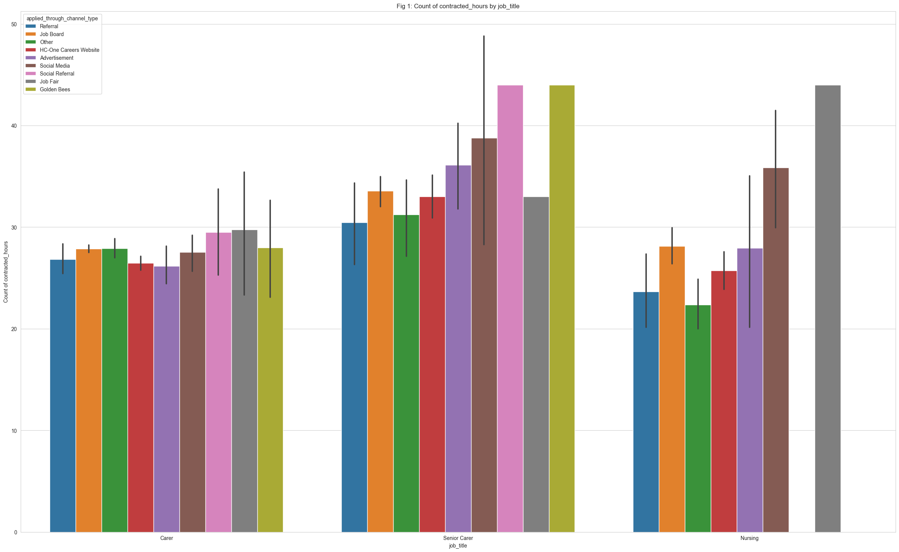
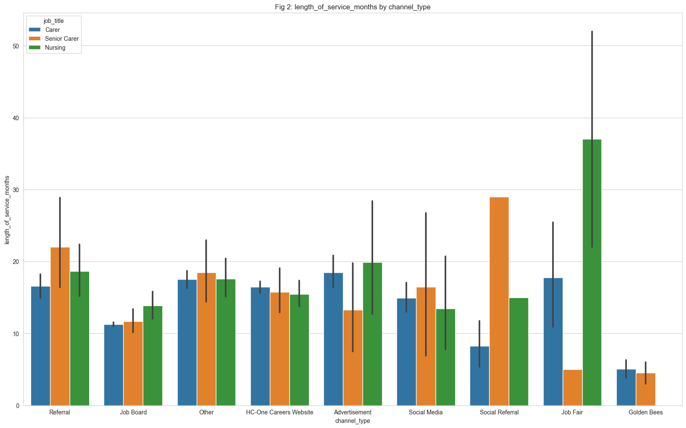
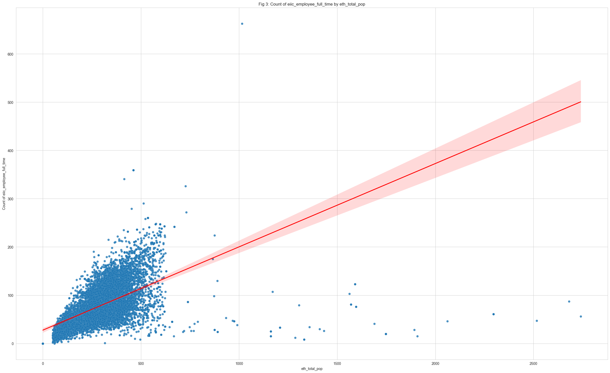
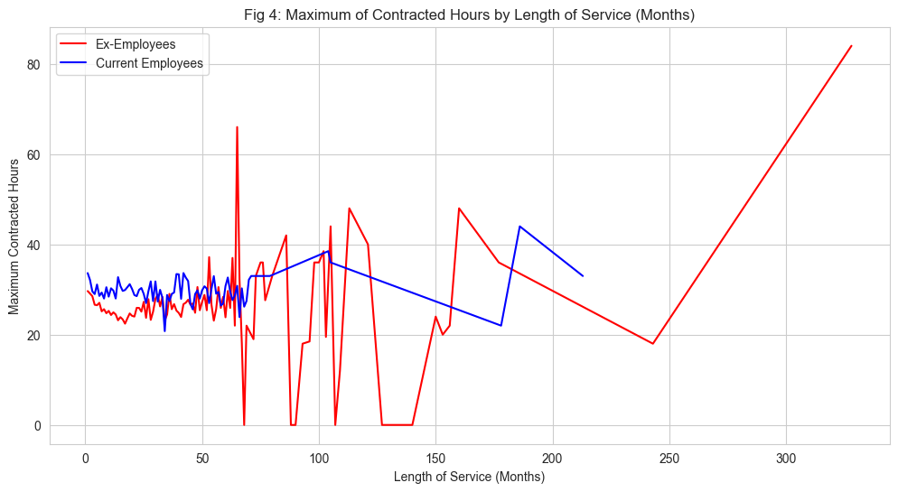
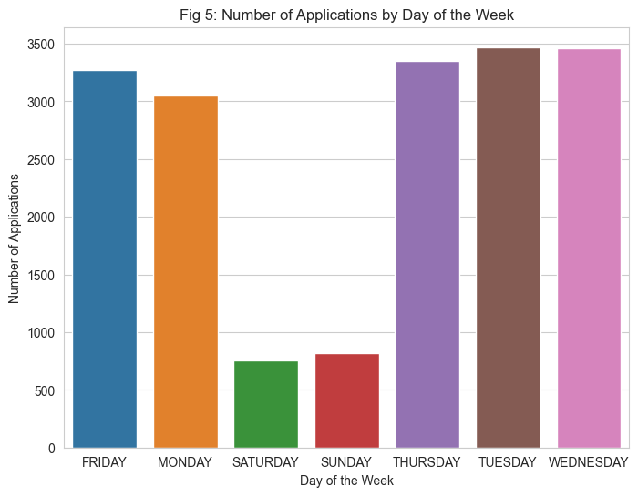
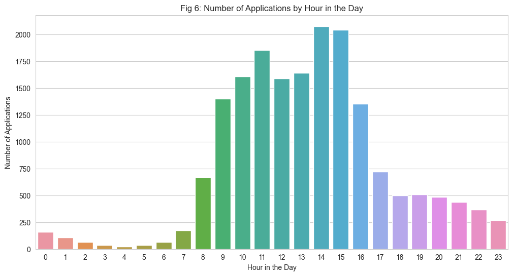
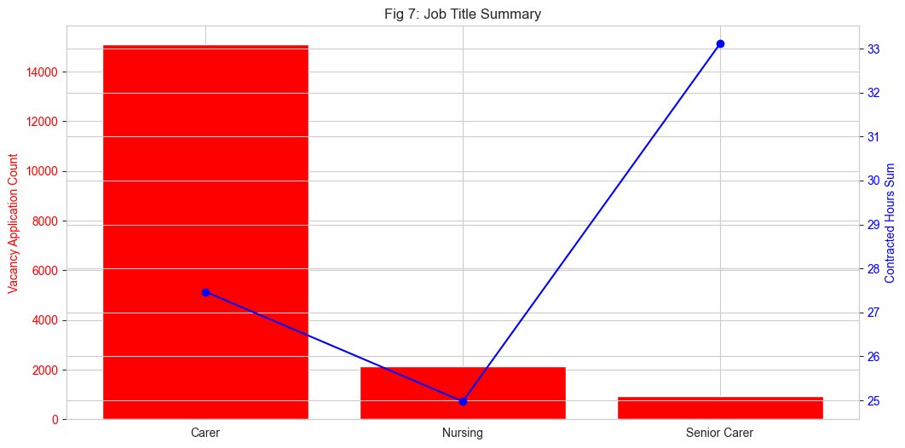
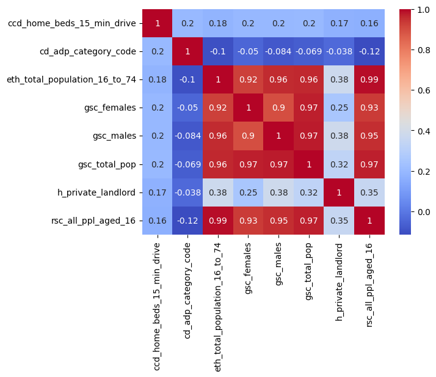

# Exploratory Data Analysis for Candidate Applications

## Project Overview

This project focuses on understanding, cleaning, and analyzing a dataset of candidate applications. The analysis involves exploratory data analysis (EDA), graphical visualizations, and correlation studies to uncover patterns and insights within the data.

## Setup and Dependencies

To run this analysis, you need the following dependencies:

- `pandas`
- `numpy`
- `seaborn`
- `matplotlib`
- `klib`
- `dataprep`
- `dtale`

Install the required libraries using:

```bash
pip install pandas numpy seaborn matplotlib klib dataprep dtale
```

## Data Cleaning

We performed data cleaning using the `klib` library to:

- Drop duplicates and empty rows/columns.
- Adjust data types for efficiency.
- Standardize column names.
- Plot missing values for an overview of data completeness.

## Exploratory Data Analysis

EDA was conducted using tools like `dataprep` and `dtale` to gain insights into the data distribution and relationships. Preprocessing steps were repeated to ensure only significant data was retained for further analysis.

## Graphical Analysis

### Summary of Figures

#### Fig 1: Contracted Hours by Job Title
Senior carers have significantly higher average contracted hours compared to other job titles. Social referrals are prevalent for carer and senior carer roles but are absent in nursing jobs.




#### Fig 2: Applications by Platform and Job Title
Applications for senior carer roles are fewer despite higher contracted hours, possibly due to stricter entry qualifications.



#### Fig 3: Demographics Analysis
Candidates from densely populated areas tend to have more full-time workers, indicating potential job market trends in these regions.



#### Fig 4: Contracted Hours vs. Length of Service
Contract hours for employees stabilize around 20-40 hours initially but show variability after 60 months, especially for ex-employees.



#### Fig 5 & 6: Applications by Day and Hour
Applications peak during weekdays (office hours) and drop significantly during weekends.




#### Fig 7: Applications and Contract Hours by Job Title
Carer jobs receive the highest applications, likely due to balanced contracted hours and entry-level requirements.



### Correlation Analysis

A correlation analysis was conducted to identify highly correlated features. The following features exhibited correlations above the threshold of 90%:

- `ccd_home_beds_15_min_drive`
- `cd_adp_category_code`
- `eth_total_population_16_to_74`
- `gsc_females`, `gsc_males`, `gsc_total_pop`
- `h_private_landlord`
- `rsc_all_ppl_aged_16`

For these features, a correlation matrix and pair plot were generated to visualize their relationships.




## Conclusion

The analysis provides valuable insights into job application trends, demographics, and job platform preferences. The graphical and correlation analyses highlight critical factors influencing candidate applications and job market dynamics.

